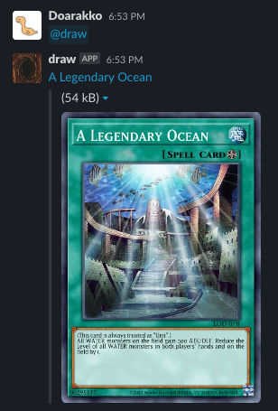

# draw-edge

Draw Yu-Gi-Oh! Card on Slack.



## Requirements

- Slack
- Cloudflare
- wrangler CLI

## Usage

### Deploy to Clooudflare Workers

1. Copy env file and enter your environment variables.

    ```sh
    cp .dev.vars.example .dev.vars
    ```

1. Deploy

    ```sh
    wrangler deploy
    ```

1. Set environmental variables to Clooudflare

    ```sh
    wrangler secret put SLACK_BOT_TOKEN
    wrangler secret put SLACK_SIGNING_SECRET
    ```

## Credits

- [Yu-Gi-Oh! API by YGOPRODeck](https://ygoprodeck.com/api-guide/)
